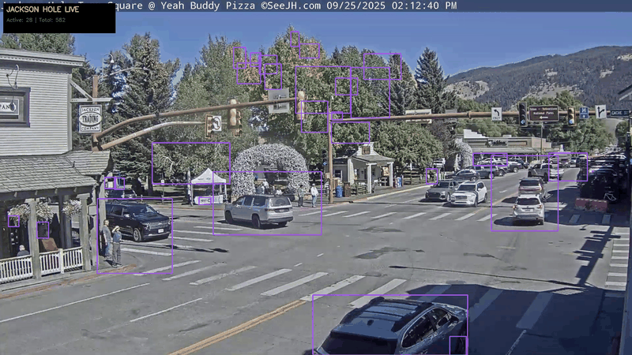

# Motion Tracking with Supervision

A powerful, universal motion tracking system using computer vision for real-time object detection and tracking. Perfect for traffic monitoring, sports analysis, robotics competitions, and any motion analysis project.


## Live Demo


*Real-time traffic tracking at Jackson Hole Town Square, Wyoming - showing vehicle detection, unique IDs, and motion trails*

## Features

- **Real-time Object Detection & Tracking** - Track multiple objects simultaneously with unique IDs
- **Motion Trail Visualization** - Visualize movement patterns and trajectories over time
- **Universal Application** - Works with any video source (webcam, files, streams, YouTube)
- **Live Statistics** - Real-time FPS, object count, tracking metrics
- **Configurable Detection** - Adjustable parameters for different scenarios

## Applications

### Traffic Monitoring
Count vehicles, analyze traffic flow, monitor intersections, estimate speeds

### Sports Analysis
Track players, analyze ball trajectories, create movement heatmaps

### Robotics Competitions
Track robot movements, analyze competition strategies, optimize paths

### Esports & Gaming
Analyze racing lines in Trackmania, track player movements, visualize strategies

### Security & Surveillance
Monitor areas for motion, track intruders, analyze patterns

### Research & Development
Track any moving objects for scientific analysis

## Installation (macOS)

### Prerequisites

1. Python 3.8 or higher
2. Homebrew (for system dependencies)

### Quick Setup

```bash
# Clone the repository
git clone https://github.com/gbechtold/motiontracking.git
cd motiontracking

# Create virtual environment
python3 -m venv venv
source venv/bin/activate

# Install dependencies
pip install -r requirements.txt
```

### For YouTube Live Streams (Optional)

```bash
# Install yt-dlp for YouTube stream support
pip install yt-dlp
```

## Quick Start

### Basic Motion Tracking

```python
from src.core.motion_tracker import MotionTracker

# Initialize tracker
tracker = MotionTracker()

# Connect to webcam
tracker.connect_source(0)  # 0 for default webcam

# Run tracking for 30 seconds
tracker.run(duration=30, save_interval=150)
```

## Detailed Examples by Use Case

### 1. Traffic Monitoring

Monitor traffic at intersections, count vehicles, estimate speeds.

```python
from src.core.motion_tracker import MotionTracker

# Traffic-optimized settings
tracker = MotionTracker(
    detection_threshold=1500,  # Large objects (vehicles)
    trail_length=50            # Longer trails for traffic analysis
)

# Connect to traffic camera or video
tracker.connect_source("traffic_video.mp4")

# Run with statistics
stats = tracker.run(duration=300, save_interval=300)  # 5 minutes

print(f"Total vehicles detected: {stats['total_objects']}")
print(f"Average FPS: {stats['fps']:.1f}")
```

**Recommended Settings for Traffic:**
- `detection_threshold`: 1500-3000 (depending on camera distance)
- `trail_length`: 50-100 (for trajectory analysis)
- Background subtractor history: 500 frames
- Morphological kernel size: 7x7 for noise reduction

### 2. Sports Tracking

Track players on a field, analyze ball movement, create heatmaps.

```python
from src.core.motion_tracker import MotionTracker

# Sports-optimized settings
tracker = MotionTracker(
    detection_threshold=400,   # Medium-sized objects (players)
    trail_length=30            # Standard trail for movement analysis
)

# For ball tracking specifically
ball_tracker = MotionTracker(
    detection_threshold=100,   # Small object (ball)
    trail_length=60           # Longer trail for trajectory
)

# Connect to sports footage
tracker.connect_source("soccer_match.mp4")

# Process match
stats = tracker.run(duration=5400)  # 90 minute match
```

**Recommended Settings for Sports:**
- **Soccer/Football:**
  - Players: `detection_threshold=400-600`, `trail_length=30`
  - Ball: `detection_threshold=80-150`, `trail_length=60`
- **Basketball:**
  - Players: `detection_threshold=500-700`, `trail_length=25`
  - Ball: `detection_threshold=100-200`, `trail_length=40`
- **Tennis:**
  - Players: `detection_threshold=300-500`, `trail_length=20`
  - Ball: `detection_threshold=50-100`, `trail_length=80`

### 3. Robotics Competition Tracking

Track robots in competition arenas, analyze movement strategies.

```python
from src.core.motion_tracker import MotionTracker

# Robotics competition settings
tracker = MotionTracker(
    detection_threshold=250,   # Small to medium robots
    trail_length=40            # Track full movement patterns
)

# Connect to overhead camera
tracker.connect_source(0)  # Webcam index

# Track for competition duration
stats = tracker.run(duration=150, save_interval=30)  # 2.5 minute match

# Analyze robot paths
robot_data = tracker.get_object_data()
for robot_id, data in robot_data.items():
    positions = data.get('positions', [])
    print(f"Robot {robot_id}: {len(positions)} position updates")
```

**Recommended Settings for Robotics:**
- **Small robots (10-30cm):** `detection_threshold=200-400`
- **Medium robots (30-50cm):** `detection_threshold=400-800`
- **Large robots (50cm+):** `detection_threshold=800-1500`
- Trail length: 40-60 for strategy analysis
- Higher FPS capture recommended (30+ FPS)

### 4. Esports - Trackmania Racing Analysis

Analyze racing lines, track car movements, optimize routes.

```python
from src.core.motion_tracker import MotionTracker

# Racing game settings
tracker = MotionTracker(
    detection_threshold=300,   # Car-sized objects
    trail_length=100          # Long trails for racing line analysis
)

# Connect to game capture
tracker.connect_source("trackmania_replay.mp4")

# Analyze race
stats = tracker.run(save_interval=60)  # Save every 2 seconds

# Export racing lines for analysis
racing_lines = tracker.get_object_data()
```

**Recommended Settings for Racing Games:**
- **Trackmania:** `detection_threshold=250-400`, `trail_length=100-150`
- **Racing simulators:** `detection_threshold=300-500`, `trail_length=80-120`
- Enable trail visualization for racing line analysis
- Use higher save_interval for detailed trajectory export

### 5. Security and Surveillance

Monitor areas for intrusion, track movement patterns.

```python
from src.core.motion_tracker import MotionTracker

# Security monitoring settings
tracker = MotionTracker(
    detection_threshold=800,   # Human-sized objects
    trail_length=30            # Standard tracking
)

# Connect to security camera
tracker.connect_source("rtsp://camera_ip:554/stream")

# Continuous monitoring
while True:
    stats = tracker.run(duration=3600)  # Run for 1 hour

    if stats['total_objects'] > 0:
        print(f"Alert: {stats['total_objects']} objects detected")
        # Send notification or save alert
```

**Recommended Settings for Security:**
- **Indoor monitoring:** `detection_threshold=600-1000`
- **Outdoor monitoring:** `detection_threshold=800-1500`
- **Perimeter detection:** `detection_threshold=1000-2000`
- Lower trail_length (20-30) for cleaner visualization
- Enable save_interval for evidence recording

## Advanced Configuration

### Detection Parameters

```python
# Fine-tuning detection
tracker = MotionTracker(
    detection_threshold=500,    # Minimum object size in pixels
    trail_length=40             # Number of positions to keep in trail
)

# Access internal components for advanced tuning
tracker.bg_subtractor.setHistory(1000)           # Longer background learning
tracker.bg_subtractor.setVarThreshold(25)        # Sensitivity to changes
tracker.bg_subtractor.setDetectShadows(True)     # Shadow removal
```

### Custom Processing Pipeline

```python
from src.core.motion_tracker import MotionTracker
import cv2

class CustomTracker(MotionTracker):
    def detect_motion(self, frame):
        # Apply custom preprocessing
        blurred = cv2.GaussianBlur(frame, (11, 11), 0)

        # Call parent detection
        detections = super().detect_motion(blurred)

        # Apply custom filtering
        filtered = self.filter_by_area(detections, min_area=1000)

        return filtered
```

### Stream Sources

```python
# Webcam
tracker.connect_source(0)

# Video file
tracker.connect_source("path/to/video.mp4")

# HTTP stream
tracker.connect_source("http://stream.url/video.mjpeg")

# RTSP stream
tracker.connect_source("rtsp://camera.ip:554/stream")

# YouTube live (requires yt-dlp)
import subprocess
result = subprocess.run(['yt-dlp', '-g', 'YOUTUBE_URL'], capture_output=True, text=True)
tracker.connect_source(result.stdout.strip())
```

## Performance Optimization

### For High FPS Processing

```python
# Reduce detection overhead
tracker = MotionTracker(
    detection_threshold=1000,  # Higher threshold
    trail_length=20            # Shorter trails
)

# Process every nth frame
frame_skip = 2
frame_count = 0
while True:
    ret, frame = cap.read()
    frame_count += 1
    if frame_count % frame_skip == 0:
        process_frame(frame)
```

### For Low-End Hardware

```python
# Optimize for performance
tracker = MotionTracker(
    detection_threshold=1500,  # Fewer detections
    trail_length=15            # Minimal trail
)

# Reduce resolution
cap.set(cv2.CAP_PROP_FRAME_WIDTH, 640)
cap.set(cv2.CAP_PROP_FRAME_HEIGHT, 480)
```

## Output and Data Export

### Accessing Tracking Data

```python
# Get all tracking statistics
stats = tracker.get_statistics()

# Get data for specific object
object_data = tracker.get_object_data(object_id=5)

# Get all objects
all_objects = tracker.get_object_data()

# Export to CSV
import csv
with open('tracking_data.csv', 'w', newline='') as file:
    writer = csv.writer(file)
    writer.writerow(['Object ID', 'First Seen', 'Last Seen', 'Positions'])
    for obj_id, data in all_objects.items():
        writer.writerow([obj_id, data['first_seen'], data['last_seen'], len(data['positions'])])
```

## Project Structure

```
motiontracking/
├── src/
│   ├── core/              # Core tracking modules
│   │   ├── motion_tracker.py
│   │   └── base_tracker.py
│   ├── trackers/          # Specialized trackers
│   └── utils/             # Utility functions
├── examples/
│   ├── traffic/           # Traffic monitoring examples
│   ├── sports/            # Sports tracking examples
│   └── robotics/          # Robotics tracking examples
├── output/                # Saved frames and videos
├── docs/                  # Documentation
├── tests/                 # Unit tests
├── requirements.txt       # Python dependencies
└── README.md
```

## Troubleshooting

### Common Issues and Solutions

**"No module named cv2"**
```bash
pip install opencv-python
```

**Camera not working on macOS**
- Check camera permissions in System Preferences > Security & Privacy
- Try different camera indices: 0, 1, 2
- Verify camera with: `ls /dev/video*`

**Stream connection failed**
- Verify URL is accessible
- Check network connectivity
- For YouTube: ensure yt-dlp is installed and updated
- For RTSP: check firewall settings

**Low FPS / Performance Issues**
- Increase detection_threshold
- Reduce trail_length
- Lower video resolution
- Skip frames in processing

**Too many false detections**
- Increase detection_threshold
- Adjust background subtractor sensitivity
- Apply additional filtering by area or aspect ratio

## Contributing

Contributions are welcome! Please feel free to submit a Pull Request.

1. Fork the repository
2. Create your feature branch (`git checkout -b feature/YourFeature`)
3. Commit your changes (`git commit -m 'Add YourFeature'`)
4. Push to the branch (`git push origin feature/YourFeature`)
5. Open a Pull Request

## License

This project is licensed under the MIT License - see the [LICENSE](LICENSE) file for details.

## Acknowledgments

- [Supervision](https://github.com/roboflow/supervision) - Computer vision tracking library
- [OpenCV](https://opencv.org/) - Computer vision foundation
- [ByteTrack](https://github.com/ifzhang/ByteTrack) - State-of-the-art tracking algorithm

## Contact

Guntram Bechtold - [GitHub](https://github.com/gbechtold)

Project Link: [https://github.com/gbechtold/motiontracking](https://github.com/gbechtold/motiontracking)

---

**Built for the motion tracking community**